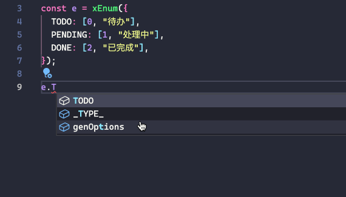

#x-enum

[中文](./README.zh-CN.md)

A tool for managing enumeration values, supports quick access to `key`, `value`, `label`, and supports generating `options` of the `Select` component.

Provide better TS type support.



## motivation

In business, we often need to maintain some enumeration values, such as status and type, which include `key: unique key (generally in English)`, `value: value (corresponding to the data stored in the backend)`,` label: Chinese name (for display)`.

Before, I would maintain these enumeration values like this:

```ts
export enum STATUS {
   // key -> value
   TODO = 1,
   PENDING = 2,
   Done = 3,
}

export const STATUS_TEXT = {
   // key -> value -> label
   [STATUS.TODO]: "todo",
   [STATUS.PENDING]: "pending",
   [STATUS.DONE]: "done",
};
```

However, this maintenance method has the following problems:

1. The key of `STATUS_TEXT` is converted to `string` instead of `number`, which needs to be converted
2. The options of the Select component cannot be quickly generated
3. It is cumbersome to select the label according to the value, which requires `STATUS_TEXT[STATUS.TODO]`

Therefore, I have summarized the following common usage scenarios in B-side scenarios:

1. The options of the select component: generally data like `{ label: string; value: string | number }[]`
2. Get the value according to the key
3. Get the label according to the key
4. Get the label according to the value
5. Get the key according to the value
6. Get all keys
7. Get all values
8. Get all labels

This function tool encapsulates the methods of the above business scenarios to facilitate maintenance of enumeration values, and **TS supports enumeration inference of key values**

## How to use

### install

```bash
npm i @xliez/x-enum
# or
yarn add @xliez/x-enum
# or
pnpm add @xliez/x-enum
```

### example

```ts
import { Select } from "antd";
import { xEnum } from "@xliez/x-enum";

const TypeEnum = xEnum({
   TODO: [0, "To Do"],
   PENDING: [1, "Processing"],
   DONE: [2, "Done"],
});

// 1. Generate select component options
const App = () => {
   return (
     <>
       <Select label="select" name="select" options={TypeEnum. genOptions()} />
     </>
   );
};

// 2. Get the value according to the key
const value = TypeEnum.TODO.value; // support TS inference
// or
const value = TypeEnum. valueByKey("TODO");

// 3. Get the label according to the key
const label = TypeEnum.TODO.label; // support TS inference
// or
const label = TypeEnum. labelByKey("TODO");

// 4. Get the key string
const key = TypeEnum.TODO.key; // support TS inference

// 5. Get the label according to the value
const label = TypeEnum. labelByValue(0);

// 6. Get the key according to the value
const key = TypeEnum. keyByValue(0);

// 7. Get all keys
const keys = TypeEnum. keys;

// 8. Get all values
const values = TypeEnum. values;

// 9. Get all labels
const labels = TypeEnum. labels;

// 10. Get the joint type of value, similar to the enum type in TS
type T = TypeEnum._TYPE_; // => 0 | 1 | 2 To prevent conflict with key, add an underscore
const a: T = 0;
```

## API

### `xEnum(enumObj: Record<string, [number | string, string?]>)`

generally:

```ts
const TypeEnum = xEnum({
   TODO: [0, "To Do"],
   PENDING: [1, "Processing"],
   DONE: [2, "Done"],
});
```

If you use key as label:

```ts
const TypeEnum = xEnum({
   to do: [0],
   PENDING: [1, "Processing"],
   DONE: [2, "Done"],
});
```

### `xEnum(enumObj: Record<string, [number | string, string?]>))` return value

| Method name | Parameters | Return value | Description |
| -------------- | -------------------------- | ------- ------------------------------------------ | ---------- -------------------------------------------------- -------------------------------------------------- ------------------------------------------------ |
| `genOptions` | `names?: [string, string]` | `{ label: string; value: string \| number }[]` | Generate select component options `names` parameter corresponds to the generated `label` `value` The name of `['label', 'value']` by default, if `[a, b]` is passed, the generated type is `{a: string, b: value}[]` |
| `valueByKey` | `key: string` | `number` | get value according to key |
| `labelByKey` | `key: string` | `string` | get label according to key |
| `labelByValue` | `value: number` | `string` | get label according to value |
| `keyByValue` | `value: number` | `string` | get the key according to the value |
| `keys` | - | `string[]` | get all keys |
| `values` | - | `number[]` | get all values |
| `labels` | - | `string[]` | get all labels |
| `_TYPE_` | - | `number \| string` | get the union type of value,